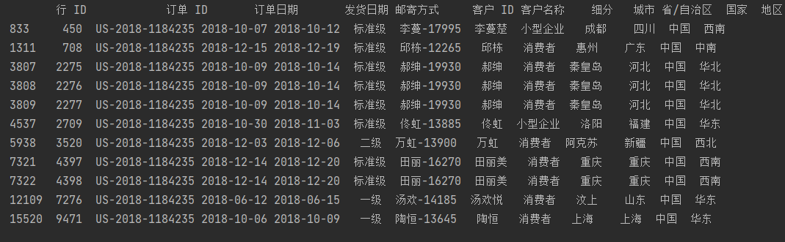

#### 5.1.2 不同省销售额贡献情况
在我对不同省份销售额分析的时候，想看看不同省份的平均客单价情况的时候，
我发现数据集中的订单ID居然不是唯一值。
```
sales_province1 = round(analysis_date.groupby(by=analysis_date["订单 ID"]).agg({"销售额": sum, "数量": "count"}), 2)
print(sales_province1)
print(analysis_date[analysis_date["订单 ID"] =="US-2018-1184235"])
```

可以看到，同一个订单应该是属于同一个客户同一时间下的订单，但是数据集中却是不同客户不同时间的订单，
所以我判断这个数据集是有问题的，这个问题会影响到有关订单的分析，比如客单价，单均价等。

