# 1. 项目背景和目的
   随着互联网与电商平台的发展，网上购物正成为国内消费者购物的重要方式。在重要的电商平台淘宝中，用户通过浏览商品详情页、收藏、加购或直接购买等方式来进行网上购物。通过对用户行为进行分析，探索用户流量在时间、流程等维度的规律，分析用户的购买量分布、留存率、价值分层，了解受欢迎的商品和商品类别现状，就可以结合店铺的相关营销策略，实现更加精细化的运营，进而服务于业务增长。
# 2. 数据集简介：
   原数据集共有1225万条左右数据，数据为淘宝APP2014年11月18日至2014年12月18日的用户行为数据，
   
共计6列字段，列字段分别是： 
- user_id：用户身份， 
- item_id：商品ID，
- behavior_type：用户行为类型（包含点击商品详情页、收藏、加购物车、支付四种行为，分别用数字1、2、3、4表示） ，
- user_geohash：地理位置，item_category：品类ID（商品所属的品类），
- time：用户行为发生的时间。
- taobao_user_behavior_cut.csv 随机抽取了其中的100万条数据进行分析，将用于下文的数据分析流程。
# 3. 分析框架与分析思路

# 4. 数据清洗
##  4.1 数据读取
```
data_analysis = pd.read_csv("data/taobao_user_behavior_cut.csv", index_col=0)
```
##  4.2 缺失值处理
```
print(data_analysis.info())
print(data_analysis.head())
```


通过info()方法和head()方法，我们可以发现字段“user_geohash”存在缺失值，
通过对数据的了解，我们知道该字段是用户地址信息，我们无法进行缺失值的处理，但是对我们的分析工作也不影响
##  4.3 重复值处理
```
print(sum(data_analysis.duplicated()))
```
通过duplicated()方法对重复值进行统计可以得到所有字段的重复的值有41143条，
由于对时间只精确到小时，所以这里重复的数据可能是用户在同一个小时内多次点击事件造成的数据重复，
所以这里的重复值不做处理。

但是为了验证我们的假设猜想，我们观察一下每个字段的重复情况
```
print(sum(data_analysis[data_analysis["behavior_type"] == 1].duplicated()))  # 40938
print(sum(data_analysis[data_analysis["behavior_type"] == 2].duplicated()))  # 14
print(sum(data_analysis[data_analysis["behavior_type"] == 3].duplicated()))  # 84
print(sum(data_analysis[data_analysis["behavior_type"] == 4].duplicated()))  # 107
```
我分别从点击，收藏，加购，和支付四个状态观察重复值，发现点击的重复值是最多的，从而验证我们的猜想。
##  4.4 异常值处理
```
print(data_analysis.describe())
```
通过describe()方法可以查看到数据的总计，平均值，最大值，最小值，四分数等可以直观的看出数据是否异常
##  4.5 文本类数值的处理
```
behavior_type = ["click", "collect", "cart", "buy"]
data_analysis["behavior_type"] = data_analysis["behavior_type"].map(lambda x: behavior_type[x-1])
```
通过map函数，将behavior_type对应的数值改为指定的字符串
##  4.6 时间序列处理
```
data_analysis["time"] = pd.to_datetime(data_analysis["time"])
data_analysis["date"] = pd.to_datetime(data_analysis["time"].dt.date)
data_analysis["day"] = data_analysis["time"].dt.day
data_analysis["hour"] = data_analysis["time"].dt.hour
```
将object类型的数据转换为datatime类型数据
##  4.7 确定各类数据类型
```
print(data_analysis.info())
```


最后确定每一列数据类型是否正确
# 5. 数据分析
##  5.1 流量维度
###     5.1.1 总体流量分析 PV/UV
```
def overall_flow_analysis():
    """
    PV:访问次数
    UV:独立访问人数
    人均访问次数：PV\UV
    日均访问次数：PV/时间段
    用户行为数据PV：点击、收藏、加购、购买的次数
    用户行为数据UV：点击、收藏、加购、购买的人数
    购买用户数量: 购买过商品的用户去重之后的数量
    人均购买次数: 购买商品行为数量/UV
    购买用户人均购买次数: 购买商品行为数量/购买用户次数
    购买率: 购买用户人数/总用户人数
    复购率: 购买两次及两次以上的用户人数/购买用户人数
    """
    # PV: 访问次数
    PV = data_analysis["user_id"].count()
    # UV: 独立访问人数
    UV = data_analysis["user_id"].nunique()
    # 人均访问次数：PV\UV
    per_capita_visits = round(PV/UV)
    # 日均访问次数：PV/时间段
    average_daily_visits = round(PV/(data_analysis["day"].nunique()+1))
    # 用户行为数据PV：点击、收藏、加购、购买的次数
    PV_action = data_analysis["behavior_type"].value_counts().sort_values(ascending=False)
    # 用户行为数据UV：点击、收藏、加购、购买的人数
    UV_action = data_analysis.groupby("behavior_type")["user_id"].nunique().sort_values(ascending=False)
    # 购买用户数量: 购买过商品的用户去重之后的数量
    num_buy = UV_action["buy"]
    # 人均购买次数: 购买商品行为数量/UV
    per_num_buy = round(PV_action["buy"]/UV, 2)
    # 购买用户人均购买次数: 购买商品行为数量/购买用户次数
    per_num_buy_num_buy = round(PV_action["buy"]/num_buy, 2)
    # 购买率: 购买用户人数/总用户人数
    purchase_rate = round(num_buy/UV, 4)*100
    # 复购率: 购买两次及两次以上的用户人数/购买用户人数
    repurchase_num = data_analysis[data_analysis["behavior_type"] == "buy"].groupby("user_id")["behavior_type"].count()
    repurchase_rate = round(repurchase_num[repurchase_num.values >= 2].count()/num_buy, 4)*100
    print(f"总访问量PV:{PV} \n"
          f"总访问量UV:{UV}\n"
          f"人均访问次数：{per_capita_visits}\n"
          f"日均访问次数：{average_daily_visits} \n"
          f"购买用户数量：{num_buy}\n"
          f"人均购买次数：{per_num_buy}\n"
          f"购买用户人均购买次数：{per_num_buy_num_buy}\n"
          f"购买率：{purchase_rate}"+"% \n"
          f"复购率：{repurchase_rate}"+"%\n"
          f"用户行为数据PV：\n {PV_action}\n"
          f"用户行为数据UV：\n {UV_action}")
```
注意事项：

- 日期之间相减容易得到几天又23小时，所以应该加1天得到时间的时间间隔天数
- groupby函数可以先对df数据进行过滤之后在分组。
- value_counts()函数可以对某列进行分组聚合求值。 
  - data["day"].value_counts().sort_index() = data.groupby("day")["user_id"].count()
- nunique() 函数可以对df进行去重得到去重后的num，可以和groupby一起使用


分析总结：
- 自2014.11.18日至2014.12.18日期间，网站总访问量100万次，总访客数9918人，
  人均访问量101次，日均访问量约3万次。
- 关于用户行为数据，其中商品详情页点击次数约94万次，
  加购次数约2万8千次，收藏次数约2万次，购买次数约1万次。
- 关于购买数据，其中购买用量约为4千6百人，人均购买次数约为1次/人，购买用户人均购买次数约为2次/人，
  购买率约46%，复购率约49%。

分析建议：
- 总体流量需要与前一个月，去年同期进行对比分析才能得出今年流量是否正常。
- 单从购买数据上看，购买用户占访问总用户接近一半，并且用户复购率也接近一半，
  可以从主观上判断平台的用户粘性很高，在一个月中访问的用户中有4分之1的用户会选择复购我们的产品。

###     5.1.2 日均流量分析 PV/UV
```
def daily_average_analysis():
    daily_flow_pv = data_analysis["day"].value_counts().sort_index()
    daily_flow_pv_click = data_analysis[data_analysis["behavior_type"] == "click"].groupby("day")["user_id"].count()
    daily_flow_pv_collect = data_analysis[data_analysis["behavior_type"] == "collect"].groupby("day")["user_id"].count()
    daily_flow_pv_cart = data_analysis[data_analysis["behavior_type"] == "cart"].groupby("day")["user_id"].count()
    daily_flow_pv_buy = data_analysis[data_analysis["behavior_type"] == "buy"].groupby("day")["user_id"].count()
    daily_flow_uv = data_analysis.groupby("day")["user_id"].nunique()
    daily_flow_uv_click = data_analysis[data_analysis["behavior_type"] == "click"].groupby("day")["user_id"].nunique()
    daily_flow_uv_collect = data_analysis[data_analysis["behavior_type"] == "collect"].groupby("day")["user_id"].nunique()
    daily_flow_uv_cart = data_analysis[data_analysis["behavior_type"] == "cart"].groupby("day")["user_id"].nunique()
    daily_flow_uv_buy = data_analysis[data_analysis["behavior_type"] == "buy"].groupby("day")["user_id"].nunique()
    # 画图
    plt.figure(figsize=(12, 8))
    grid = plt.GridSpec(3, 2, wspace=0.1, hspace=0.4)
    plt.subplot(grid[0, 0:2])
    plt.plot(daily_flow_pv.index, daily_flow_pv.values, label="PV")
    plt.plot(daily_flow_uv.index, daily_flow_uv.values, label="UV")
    plt.legend()
    plt.title("12月PV/UV关系图")
    plt.xticks(daily_flow_pv.index)

    plt.subplot(grid[1, 0])
    plt.plot(daily_flow_pv.index, daily_flow_pv.values, label="PV")
    plt.plot(daily_flow_pv.index, daily_flow_pv_click.values,  label="click")
    plt.legend()
    plt.title("12月访问量和点击量折线图")

    plt.subplot(grid[2, 0])
    plt.plot(daily_flow_pv.index, daily_flow_pv_collect.values, label="collect")
    plt.plot(daily_flow_pv.index, daily_flow_pv_cart.values, label="cart")
    plt.plot(daily_flow_pv.index, daily_flow_pv_buy.values, label="buy")
    plt.legend()
    plt.title("12月收藏/加购/支付次数折线图")
    plt.xticks(daily_flow_pv.index)

    plt.subplot(grid[1, 1])
    plt.plot(daily_flow_pv.index, daily_flow_uv.values, label="UV")
    plt.plot(daily_flow_pv.index, daily_flow_uv_click.values, label="click")
    plt.legend()
    plt.title("12月访问人数和点击人数折线图")

    plt.subplot(grid[2, 1])
    plt.plot(daily_flow_pv.index, daily_flow_uv_collect.values, label="collect")
    plt.plot(daily_flow_pv.index, daily_flow_uv_cart.values, label="cart")
    plt.plot(daily_flow_pv.index, daily_flow_uv_buy.values, label="buy")
    plt.legend()
    plt.title("12月收藏/加购/支付人数折线图")
    plt.xticks(daily_flow_pv.index)
    plt.show()
```


分析与总结：
 - 双12前后近一个月的时间内，日均pv在30000左右，日均uv在5000左右。
 - 通过pv和click折线图的观察，可以发现他们呈现高度拟合，尤其是在活动期间，可以说明用户质量很高，以及用户平台的商品有很强的兴趣。  
 - 在双12前后3天，以及12.18前后三天pv和uv有明显著的提高，说明平台活动对调动用户活跃以及支付行为有很强的正面意义。
 - 需要注意的是在平台活动期后，用户的活跃度相比活动期前有一定的回落，可以推测活动期对一部分用户有很强的召回作用，但是活动期结束，那部分用户就走了。
 - 虽然活动期结束后uv和click有所下降，但是用户的购买力却保持了稳定。
 - 我想知道加购行为对购买的影响更大还是收藏行为对购买的影响更大。
###     5.1.3 时均流量分析 PV/UV
```
def time_average_flow_analysis():
    plt.figure(figsize=(12, 8))
    time_average_flow_pv = data_analysis.groupby("hour")["user_id"].count()
    time_average_flow_uv = data_analysis.groupby("hour")["user_id"].nunique()
    plt.plot(time_average_flow_pv.index, time_average_flow_pv.values, label="pv")
    plt.plot(time_average_flow_uv.index, time_average_flow_uv.values, label="uv")
    plt.legend()
    plt.title("时均流量pv/uv的变化情况")
    plt.xticks(time_average_flow_uv.index)
    plt.yticks(np.linspace(0, 100000, 51)[::2])
    plt.xlabel("小时")
    plt.ylabel("流量")
    plt.show()

    plt.figure(figsize=(12, 8))
    time_average_flow_uv_click = data_analysis[data_analysis["behavior_type"] == "click"].groupby("hour")["user_id"].nunique()
    time_average_flow_uv_collect = data_analysis[data_analysis["behavior_type"] == "collect"].groupby("hour")["user_id"].nunique()
    time_average_flow_uv_cart = data_analysis[data_analysis["behavior_type"] == "cart"].groupby("hour")["user_id"].nunique()
    time_average_flow_uv_buy = data_analysis[data_analysis["behavior_type"] == "buy"].groupby("hour")["user_id"].nunique()
    plt.plot(time_average_flow_uv_click.index, time_average_flow_uv_click.values, label="click")
    plt.plot(time_average_flow_uv_collect.index, time_average_flow_uv_collect, label="collect")
    plt.plot(time_average_flow_uv_cart.index, time_average_flow_uv_cart, label="cart")
    plt.plot(time_average_flow_uv_buy.index, time_average_flow_uv_buy.values, label="buy")
    plt.legend()
    plt.title("时均流量的变化情况")
    plt.xticks(time_average_flow_uv.index)
    plt.xlabel("小时")
    plt.ylabel("用户数")
    plt.show()
```


 - 从时均流量变化，可以看出：1. 购买量在17时到18时达到最低值 2. 自18时起，各项指标呈现稳步上升趋势，在22时左右达到最大值 3. 23时到凌晨4时左右，各项指标呈现下降趋势。
 - 通过对时均流量的观察我们发现用户的购买欲望在晚上9点-10点是最强的。所以晚上不要逛淘宝不是空穴来风。
 - 在凌晨4点的时候浏览量，点击量，购买量都是最低的，购买人数只有19人，我很好奇这19人在晚上都买什么东西。
 
分析与建议：
 - 18时至22时，用户行为活动活跃，人们习惯在此此间浏览商品、购买商品
 - 根据这一特征，从用户角度出发，可以将与用户最相关的商品推送、最优惠的活动推送放在此段时间，以提高流量转化率；
 - 从商品角度出发，此段时间的流量应当向高转化率、高销量的优质商品倾斜；
 - 从直通车等内部推广角度来说，可以针对此时段的流量适当提高定价，同时鼓励此时段的内部直播活动，
 - 从站外推广角度来说，可以考虑增加此时段的流量推广以提高收益。23时-4时，以及17-18时，是用户行为活动的低谷期，减少高成本的流量推广活动，在推送消息次数有限的前提下减少此时段的消息推送。
```
time_average_flow_uv_buy_w = data_analysis[(data_analysis["hour"] == 4) & (data_analysis["behavior_type"] == "buy")]
print(time_average_flow_uv_buy_w)

# 可惜只有商品的id，没有商品的sku
```

###     5.1.4 用户流量漏斗分析
```
def user_flow_funnel_analysis():
    user_flow = data_analysis["behavior_type"].value_counts()
    user_flow["pv"] = data_analysis["user_id"].count()
    user_flow = pd.DataFrame(user_flow)
    change_rate = {"点击转化率": round(user_flow.loc["click"]/user_flow.loc["pv"], 4),
                   "点击/收藏转化率": round(user_flow.loc["collect"]/user_flow.loc["click"], 4),
                   "点击/加购转化率": round(user_flow.loc["cart"]/user_flow.loc["click"], 4),
                   "点击/购买转化率": round(user_flow.loc["buy"]/user_flow.loc["click"], 4),
                   "加购/购买转化率": round(user_flow.loc["buy"]/user_flow.loc["cart"], 4),
                   "收藏/购买转化率": round(user_flow.loc["buy"]/user_flow.loc["collect"], 4),
                   }
    change_rate = pd.DataFrame(change_rate,).T
    change_rate["转化率"] = change_rate["behavior_type"].apply(lambda x: format(x, '.2%'))
    change_rate = change_rate.drop(columns="behavior_type")
    print(change_rate)
```


 - 点击转化率达到94%，说明用户打开我们平台对商品很感兴趣，可能是平台的推荐机制得到用户的认可。
 - 但是收藏，加购，支付的转化率都不超过3%，可以反应用户进入商品详情页之后并未对商品产生兴趣，可以考虑定价相对同行是否过高、详情页是否需要优化、售前服务质量是否有待提高等维度来定位问题所在。
 - 虽然收藏、加购相较于购买的比率较高，但由于此处收藏与加购的用户商品并未与购买的用户商品一一对应，不能得出收藏加购后购买的可能性提高的结论，需要对用户的购买路径进行分析才能得出相关结论，出现此问题的原因主要是点击详情页、收藏、加购这三个步骤相较于购买这一步骤都不是必须的，故而无法通过简单的流量比率来判断各环节的转化率。
###     5.1.5 跳出率
```
def jump_rate():
    user_bouncenum=data_analysis.groupby("user_id").filter(
        lambda x: x["behavior_type"].count() == 1 and (x["behavior_type"] == "click").all())["user_id"].count()
    user_num = data_analysis["user_id"].nunique()
    user_bouncerate = user_bouncenum/user_num
    print("总用户数：" + str(user_num))
    print("跳出用户数：" + str(user_bouncenum))
    print("跳出率：%.2f%%" % (round(user_bouncerate, 4)*100))
```
总用户数：9918

跳出用户数：96

跳出率：0.97%

分析总结：
 - 就这一个月来说，跳出率仅0.97%，较低，说明用户并不会仅仅访问一个商品详情页就离开（离开指至少这个月不再回来该平台），说明商品或广告对用户具有吸引力，用户愿意在后续的商品选购操作过程中花费时间。
 - 由于数据并未有浏览时间，无法对单个商品进一步分析。
##  5.2 用户维度
###     5.2.1 用户购买量
```
def user_purchases():
    # 购买次数前十客户
    user_purchases = data_analysis[data_analysis["behavior_type"] == "buy"]["user_id"].value_counts().sort_values(ascending=False)
    print(user_purchases[0:10])
    # 购买频次直方图
    plt.figure(figsize=(12, 8))
    sns.displot(user_purchases.values, bins=70, kde=True, label='人数')
    plt.title("购买次数直方图")
    plt.xlabel('次数')
    plt.ylabel('人数')
    plt.legend()
    plt.show()
```


分析总结：
 - 从购买次数前10的用户数据可以看出，购买次数前十的用户购买次数均超过10次；从购买次数频数分布直方图可以看出，一个月内购买次数大于等于2次的用户在50%左右，购买次数大于等于3次的用户在25%左右。 
 - 针对购买次数较高的用户（如购买次数>=5次，这类用户约占10%）提供更加精细化的服务，如提供专属服务、优质售后等，提高用户对平台的满意度；考虑到复购率约在50%，购买次数大于等于3的用户仅在25%左右，可以考虑建立有关购买次数的激励措施，如在会员制度中加入该因素，同时适当增加推广和精准的活动促销，持续监控平台商品质量，促进用户的复购。
###     5.2.2 用户留存率分析
```
def retention(user_new, date_frame, cloumn, date, n):
    """
    计算n日留存率
    :param user_new: 新增用户的用户id集
    :param date_frame:数据集
    :param cloumn:数据集中日期列的列名
    :param date: 循环变量，日期
    :param n: 计算n日留存
    :return:返回一个Series类型的数据，数据为第n日的留存率
    """
    date_max = pd.Series(date_frame[cloumn].unique()).max()  # 计算出日期最大的日期
    retention_action_user = date_frame[date_frame[cloumn] == date+pd.to_timedelta(n, unit='D')]["user_id"].unique()  # 次日登录的用户id
    retention_action_user_num = set()  # 次日登录的用户并且在当日登陆过的用户id
    for x in retention_action_user:
        if x in user_new:
            retention_action_user_num.add(x)
    retention_rate = len(retention_action_user_num)/len(user_new) if date+pd.to_timedelta(n, unit='D') <= date_max else 0
    return retention_rate


def user_preserve():
    """
    计算用户留存率的矩阵
    :return:
    """
    # 由于只有这一个月的用户数据，并不能判断用户是否是新增用户，所以我们将这个月第一次登录的用户看作新增用户
    # 新增用户数 = 这个月第一次登录的用户
    data_retain = pd.DataFrame(columns=["日期", "基期用户数", "次日留存率", "3日留存率", "7日留存率", "14日留存率", "30日留存率"])
    data_retain_base = set()  # 总用户id集合
    for date in data_analysis["date"].unique():
        data_retain_new = data_analysis[data_analysis["date"] == date]["user_id"].unique()
        user_new = set()  # 新增用户的用户id集
        for x in data_retain_new:
            if x not in data_retain_base:
                user_new.add(x)
        data_retain_base.update(user_new)
        user_new_num = len(user_new)  # 新增用户数
        # 次日留存 = 次日还活跃的用户/当日新增用户数
        next_day_rate = retention(user_new, data_analysis, "date", date, 1)
        three_day_rate = retention(user_new, data_analysis, "date", date, 2)
        seven_day_rate = retention(user_new, data_analysis, "date", date, 6)
        two_week_day_rate = retention(user_new, data_analysis, "date", date, 13)
        thriy_day_rate = retention(user_new, data_analysis, "date", date, 29)
        data_retain_item = {"日期": [date], "新增用户数": [user_new_num], "次日留存率": [round(next_day_rate, 4)], "3日留存率": [round(three_day_rate, 4)],
                            "7日留存率": [round(seven_day_rate, 4)], "14日留存率": [round(two_week_day_rate, 4)], "30日留存率": [round(thriy_day_rate, 4)]}
        data_retain_item = pd.DataFrame(data_retain_item)
        data_retain = pd.concat([data_retain, data_retain_item], axis=0, join="inner")
        data_retain.index = range(0, data_retain.shape[0])
    # 留存率折线图
    line_retain = Line()
    line_retain.add_xaxis(data_retain["日期"].tolist())
    line_retain.add_yaxis("次日留存率", data_retain["次日留存率"].tolist())
    line_retain.add_yaxis("3日留存率", data_retain["3日留存率"].tolist())
    line_retain.add_yaxis("7日留存率", data_retain["7日留存率"].tolist())
    line_retain.add_yaxis("14日留存率", data_retain["14日留存率"].tolist())
    line_retain.add_yaxis("30日留存率", data_retain["30日留存率"].tolist())
    line_retain.set_series_opts(label_opts=opts.LabelOpts(is_show=False))
    line_retain.set_global_opts(title_opts=opts.TitleOpts(title="留存率随日期变动"),
                                xaxis_opts=opts.AxisOpts(name='日期'),
                                yaxis_opts=opts.AxisOpts(name='留存率'))
    line_retain.render("data/template/retention_line.html")
    print(data_retain)
    print("平均次日留存率: "+str(round(data_retain[data_retain["次日留存率"]!=0]["次日留存率"].mean(),4)))
    print("平均3日留存率: "+str(round(data_retain[data_retain["3日留存率"]!=0]["3日留存率"].mean(),4)))
    print("平均7日留存率: "+str(round(data_retain[data_retain["7日留存率"]!=0]["7日留存率"].mean(),4)))
    print("平均14日留存率: "+str(round(data_retain[data_retain["14日留存率"]!=0]["14日留存率"].mean(),4)))
    print("平均30日留存率: "+str(round(data_retain[data_retain["30日留存率"]!=0]["30日留存率"].mean(),4)))
```


分析总结：
 - 制作留存矩阵需要知道系统中的总用户数，然后筛选出当日用户数去重，判断每一个用户是否在总用户中，如果不在就是新增用户，并把新增用户添加到总用户中。
 - n日留存的计算方法就是用当日新增除以当日+n天的还活跃的用户，并且在当日用户中。
 - 从平均留存率看出，用户的次日留存率不超过40%，并且3日留存是最低的，但是7日留存却有所回升，说明用户登录平台有周期性。
 - 从留存折线图中可以看出，用户在12.1日和12.12日活动期间有很强的召回用户效用。
###     5.2.3 用户购买路径偏好分析


###     5.2.4 用户价值RFM模型分析
由于数据集缺少消费金额数据，所以我们只分析，R（最近一次购买），F（消费频次）将用户分为4个类别

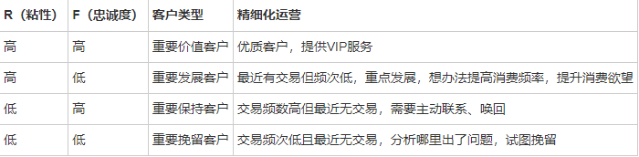
```
def r_score(x):
    if x < 3:
        return 5
    elif x>=3 and x<6:
        return 4
    elif x>=5 and x<8:
        return 3
    elif x>=8 and x<18:
        return 2
    else:
        return 1


def f_score(x):
    if x == 1:
        return 1
    elif x == 2:
        return 2
    elif x == 3:
        return 3
    elif x == 4:
        return 4
    else:
        return 5


def user_value_analysis():
    """
    由于数据集缺少消费金额数据，所以我们只分析，R（最近一次购买），F（消费频次）将用户分为4个类别
    :return:
    """
    date_max = data_analysis["date"].max()
    data_RFM = pd.DataFrame()
    data_RFM["R"] = (date_max - data_analysis[data_analysis["behavior_type"] == "buy"].groupby("user_id")["date"].max()).map(lambda x: x.days)
    data_RFM["F"] = data_analysis[data_analysis["behavior_type"] == "buy"].groupby("user_id")["date"].count()
    # 1. 用户最近购买的时间间隔分布图
    # 查看用户最近购买的时间间隔的分布，为后续对R进行分箱打分提供指导依据。
    recently_purchased = pd.DataFrame()
    recently_purchased["num"] = data_RFM.groupby("R")["F"].count()
    recently_purchased_index = [str(x) for x in recently_purchased.index]
    plt.figure(figsize=(12, 8))
    plt.bar(recently_purchased_index, recently_purchased["num"])
    for a, b in zip(recently_purchased_index, recently_purchased["num"]):  # 添加数据标签
        plt.text(a, b+0.05, '%.f' % b, ha='center', va='bottom', fontsize=10)
    plt.title("最近购买时间分布间隔")
    plt.xlabel("天数")
    plt.ylabel("次数")
    plt.show()
    # 2. 查看R、F值的百分位分布情况
    # 为后续R、F打分提供指导依据。
    print(data_RFM.describe())
    # 3. 计算R、F得分，并得出R、F值的高低
    data_RFM["r_score"] = data_RFM["R"].map(r_score)
    data_RFM["f_score"] = data_RFM["F"].map(f_score)
    data_RFM["r_num"] = data_RFM["r_score"].apply(lambda x: 1 if x > data_RFM["r_score"].mean() else 0)
    data_RFM["f_num"] = data_RFM["f_score"].apply(lambda x: 1 if x > data_RFM["f_score"].mean() else 0)
    data_RFM["rfm_num"] = data_RFM["r_num"].map(str)+data_RFM["f_num"].map(str)
    dic = {
        "11": "重要价值用户",
        "10": "重要发展用户",
        "01": "重要保持客户",
        "00": "重要挽留用户"
    }
    data_RFM["user_classification"] = data_RFM["rfm_num"].map(dic)
    print(data_RFM.head())
    print(data_RFM["user_classification"].value_counts())
    print(data_RFM["user_classification"].value_counts(True))
    #不同价值客户占比图
    label = data_RFM["user_classification"].value_counts(True).index.tolist()
    num = round(data_RFM["user_classification"].value_counts(True), 4).tolist()
    pie = Pie().add("", [z for z in zip(label, num)])
    pie.set_global_opts(title_opts=opts.TitleOpts(title="不同价值客户占比"))
    pie.set_series_opts(label_opts=opts.LabelOpts(formatter="{b}:{d}%"))
    pie.render("data/template/pie_user_classification.html")
```
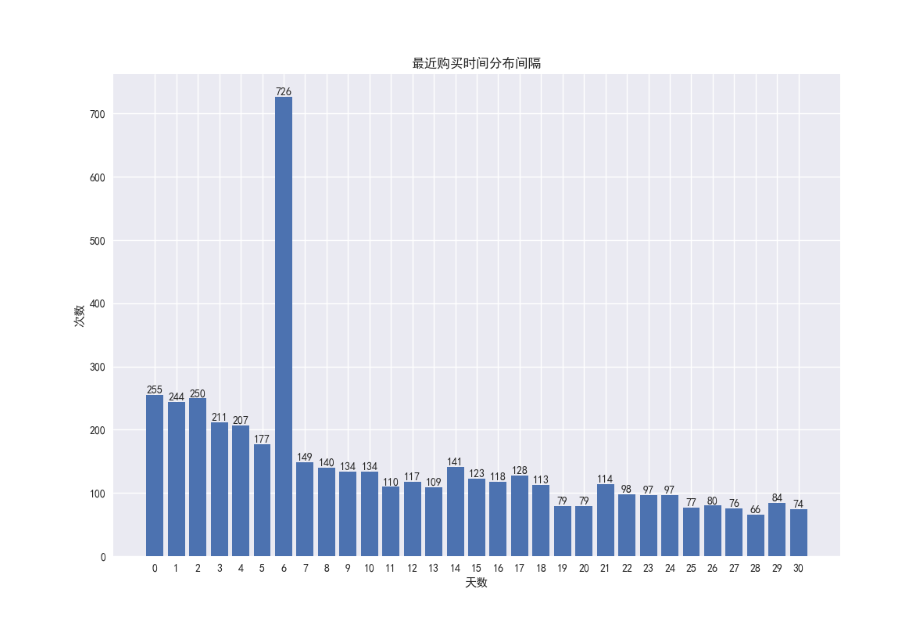

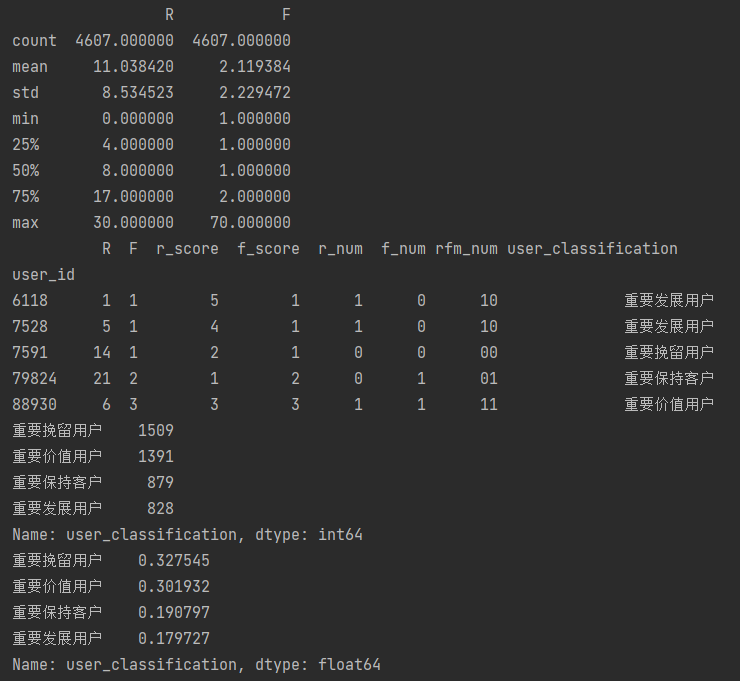

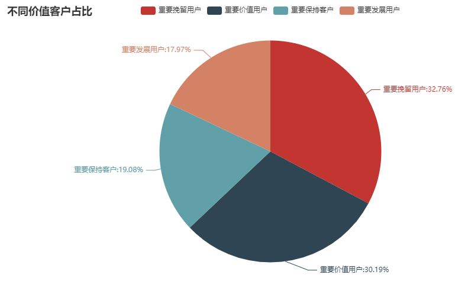

 - 根据RFM用户价值分析对用户进行分类，其中重要价值用户和重要挽留用户各占约30%，重要发展用户和重要保持用户各占约20%。
 - 分析与建议：应针对不同价值的用户采取不同的运营策略。总的来说，应当提升重要价值用户占比，减少重要挽留用户占比。
   - 重要价值用户：主要提升该部分用户的满意度，服务升级，发放专属特别优惠，推送推广时也应当注意频率和方式，提升用户体验。
   - 重要发展用户：最近消费时间间隔小，但消费频率不高，需要提高其消费频率，可在每次购买商品收货后提供限时代金券、限时优惠券等，提升下一步的消费欲望。
   - 重要保持用户：交易频繁但最近无交易，可以向该类用户增加活动优惠、相关商品的推送频率等，唤回该部分用户。
   - 重要挽留用户：最近消费时间间隔大，且消费频率低，这类用户即将流失，发放调查问卷调查用户体验找出问题原因，想办法挽留客户，若是价格原因则推送优惠券，若是推送不准确则改进推送机制。
##  5.3 商品维度
###     5.3.1 商品数量与商品类别
###     5.3.2 top10商品分析
商品分析也可以从点击、收藏、加购和购买四个角度来分析，通过用户购买路径偏好分析，当前收藏和加购并不能有效促进销量的提升，故而这里主要针对点击量和购买量来对商品进行分析。通过点击量可以看出，商品是否对用户具有吸引力，通过购买量可以看出用户对商品的需求，通过统计商品的点击购买率，可以看出商品点击流量的转化情况。
####            5.3.2.1 点击量top10商品
####            5.3.2.2 购买量top10商品
```
def product_analysis():
    # 5.3.1 商品数量与商品类别
    print(f"商品数量:{data_analysis['item_id'].nunique()}")
    print(f"商品类别数量:{data_analysis['item_category'].nunique()}")
    # 5.3.2.1 点击量top10商品
    click_top10 = data_analysis[data_analysis["behavior_type"] == "click"]["item_id"].value_counts().head(10)
    click_top10_index = [str(x) for x in click_top10.index]
    plt.bar(click_top10_index, click_top10.values)
    for a, b in zip(click_top10_index, click_top10.values):  # 添加数据标签
        plt.text(a, b+0.05, '%.f' % b, ha='center', va='bottom', fontsize=10)
    plt.title("商品点击量top10")
    plt.xlabel("商品")
    plt.xticks(click_top10_index, rotation=45)
    plt.ylabel("数量")
    plt.show()

    # 5.3.2.2 购买量top10商品
    buy_top10 = data_analysis[data_analysis["behavior_type"] == "buy"]["item_id"].value_counts().head(10)
    buy_top10_index = [str(x) for x in buy_top10.index]
    plt.bar(buy_top10_index, buy_top10.values)
    for a, b in zip(buy_top10_index, buy_top10.values):  # 添加数据标签
        plt.text(a, b+0.05, '%.f' % b, ha='center', va='bottom', fontsize=10)
    plt.title("商品购买量top10")
    plt.xlabel("商品")
    plt.xticks(buy_top10_index, rotation=45)
    plt.ylabel("数量")
    plt.show()

    # 5.3.2.3 购买量top10的商品进行购买点击率分析
    data_top10_clickbuyrate1 = pd.DataFrame()
    data_top10_clickbuyrate1["click"] = data_analysis[data_analysis["behavior_type"] == "click"].groupby("item_id")["user_id"].count()
    data_top10_clickbuyrate2 = pd.DataFrame()
    data_top10_clickbuyrate2["collect"] = data_analysis[data_analysis["behavior_type"] == "collect"].groupby("item_id")["user_id"].count()
    data_top10_clickbuyrate3 = pd.DataFrame()
    data_top10_clickbuyrate3["cart"] = data_analysis[data_analysis["behavior_type"] == "cart"].groupby("item_id")["user_id"].count()
    data_top10_clickbuyrate4 = pd.DataFrame()
    data_top10_clickbuyrate4["buy"] = data_analysis[data_analysis["behavior_type"] == "buy"].groupby("item_id")["user_id"].count()
    result = pd.merge(data_top10_clickbuyrate1, data_top10_clickbuyrate2, how="outer", left_index=True, right_index=True)
    result = pd.merge(result, data_top10_clickbuyrate3, how="outer", left_index=True, right_index=True)
    result = pd.merge(result, data_top10_clickbuyrate4, how="outer", left_index=True, right_index=True)
    result["buy_click_rate"] = round(result["buy"]/result["click"]*100, 2)
    result = result.fillna(0)
    result["buy_click_rate"] = result["buy_click_rate"].map(lambda x: str(x)+"%")
    # 购买量前10的商品点击购买转化率
    print(result.sort_values(by="buy", ascending=False).head(10))
    # 购买量前10的商品点击购买转化率
    print(result.sort_values(by="click", ascending=False).head(10))
```
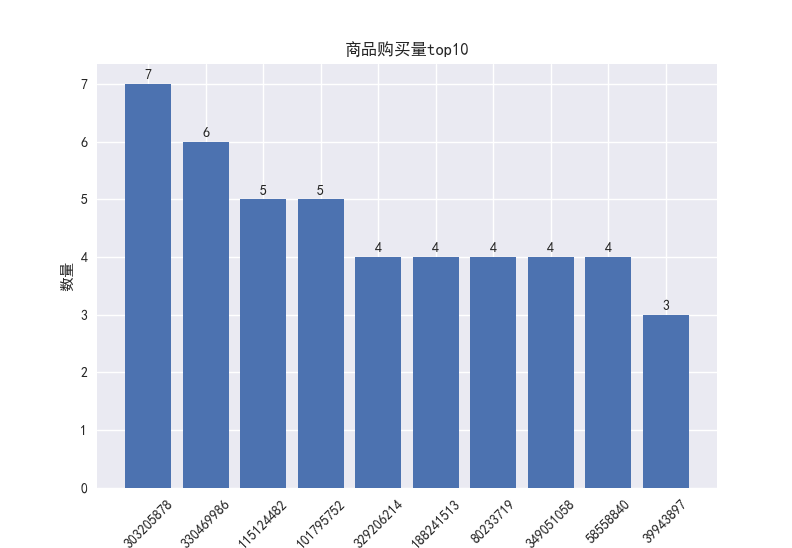

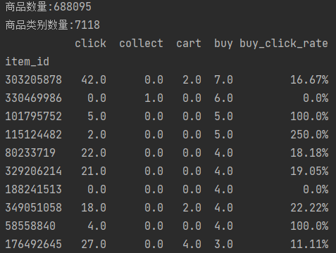
 - 对于购买量前列的商品，可以将购买点击率分为100%以上（包括无限大）、50%-100%、20%-50%、0-20%四个区间，针对不同区间使用不同的运营策略。
   分析与建议：
    - 转化率在100%以上的：这类商品转化率极高，可能是快消类、囤货类、同质类商品，不需要过多的点击查看商品详情就可以进行购买决策，可向有这类消费需求的用户推送此类商品。
    - 转化率在50%-100%间的（top10商品中并没有出现）：这类商品购买点击率较高，说明用户搜索和点击商品目标明确，此类商品可能是特定特征群体需要的，此时可以收集用户信息分析用户画像，结合商品特征核实是否有更具体的用户特征，如果有就可以进行更精准的推送；另一方面，也可能是商品异质性较低，可选择性不强导致的，需要分析该类别商品的异质性，如果有此类问题可以尝试将类别中有区分度的商品给予更多的流量倾斜观察是否会带来更多的销量；如果以上假设均不成立，可以尝试对此类商品多做推广，毕竟原有转化率较高，较高的流量推广可能带来更多的购买量。
    - 转化率在20%-50%间的：商品转化率一般，可以多做促销活动，将潜在用户转化为购买用户。
    - 转化率在20%以下的：商品转化率较低，此时应更多的从商品本身来分析，购买量处于前列，但是购买点击率很低，可能是这部分商品做了流量推广但是推广针对的用户不准确，导致用户虽然点击但只有较少的用户选择了购买，也可能是商品价格远高于同类产品，导致最终成单率较低，又或者商品评价较差导致销量增加迟缓，需要分析更多的信息以作出进一步的判断，并针对分析的结果做出相应改善对策。

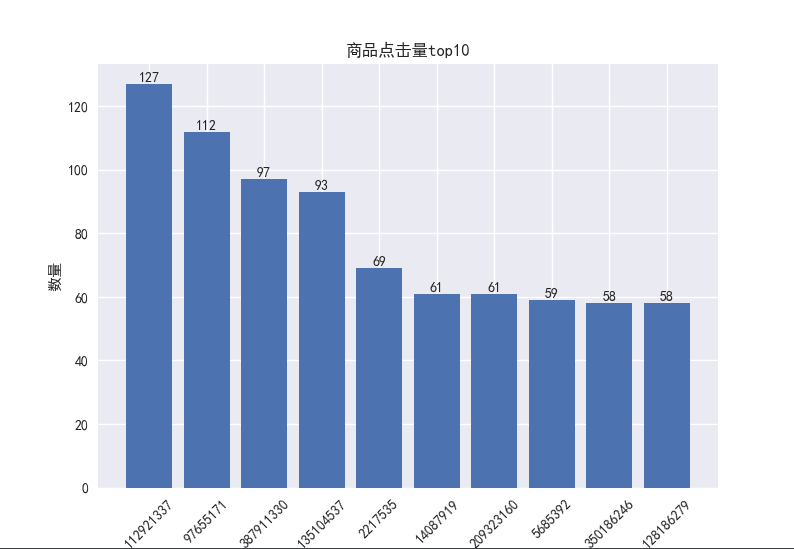

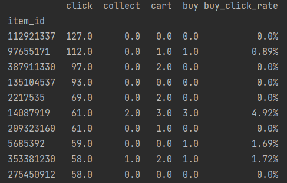
 - 点击量前十的商品的购买点击率很低，说明用户点击量高但是转化率却很低，分析原因与上述top10购买量商品转化率20%以下的分析基本一致，可能是做了不精准或者不必要（没有那么大市场需求）的流量推广，或者平台的推送不准确，或者商品价格原因、质量原因等导致用户不愿意购买，需要结合更多信息以进行进一步的分析。
###     5.3.3 top10商品类别分析
```
def product_category():
    click_top10 = data_analysis[data_analysis["behavior_type"] == "click"]["item_category"].value_counts().head(10)
    click_top10_index = [str(x) for x in click_top10.index]
    plt.bar(click_top10_index, click_top10.values)
    for a, b in zip(click_top10_index, click_top10.values):  # 添加数据标签
        plt.text(a, b+0.05, '%.f' % b, ha='center', va='bottom', fontsize=10)
    plt.title("商品类别点击量top10")
    plt.xlabel("商品类别")
    plt.xticks(click_top10_index, rotation=45)
    plt.ylabel("数量")
    plt.show()

    # 5.3.3.2 购买量top10商品类别
    buy_top10 = data_analysis[data_analysis["behavior_type"] == "buy"]["item_category"].value_counts().head(10)
    buy_top10_index = [str(x) for x in buy_top10.index]
    plt.bar(buy_top10_index, buy_top10.values)
    for a, b in zip(buy_top10_index, buy_top10.values):  # 添加数据标签
        plt.text(a, b+0.05, '%.f' % b, ha='center', va='bottom', fontsize=10)
    plt.title("商品类别购买量top10")
    plt.xlabel("商品类别")
    plt.xticks(buy_top10_index, rotation=45)
    plt.ylabel("数量")
    plt.show()

    # 5.3.2.3 购买量top10的商品类别进行购买点击率分析
    data_top10_clickbuyrate1 = pd.DataFrame()
    data_top10_clickbuyrate1["click"] = data_analysis[data_analysis["behavior_type"] == "click"].groupby("item_category")["user_id"].count()
    data_top10_clickbuyrate2 = pd.DataFrame()
    data_top10_clickbuyrate2["collect"] = data_analysis[data_analysis["behavior_type"] == "collect"].groupby("item_category")["user_id"].count()
    data_top10_clickbuyrate3 = pd.DataFrame()
    data_top10_clickbuyrate3["cart"] = data_analysis[data_analysis["behavior_type"] == "cart"].groupby("item_category")["user_id"].count()
    data_top10_clickbuyrate4 = pd.DataFrame()
    data_top10_clickbuyrate4["buy"] = data_analysis[data_analysis["behavior_type"] == "buy"].groupby("item_category")["user_id"].count()
    result = pd.merge(data_top10_clickbuyrate1, data_top10_clickbuyrate2, how="outer", left_index=True, right_index=True)
    result = pd.merge(result, data_top10_clickbuyrate3, how="outer", left_index=True, right_index=True)
    result = pd.merge(result, data_top10_clickbuyrate4, how="outer", left_index=True, right_index=True)
    result["buy_click_rate"] = round(result["buy"]/result["click"]*100, 2)
    result = result.fillna(0)
    result["buy_click_rate"] = result["buy_click_rate"].map(lambda x: str(x)+"%")
    # 购买量前10的商品类别点击购买转化率
    print(result.sort_values(by="buy", ascending=False).head(10))
    # 购买量前10的商品类别点击购买转化率
    print(result.sort_values(by="click", ascending=False).head(10))
```

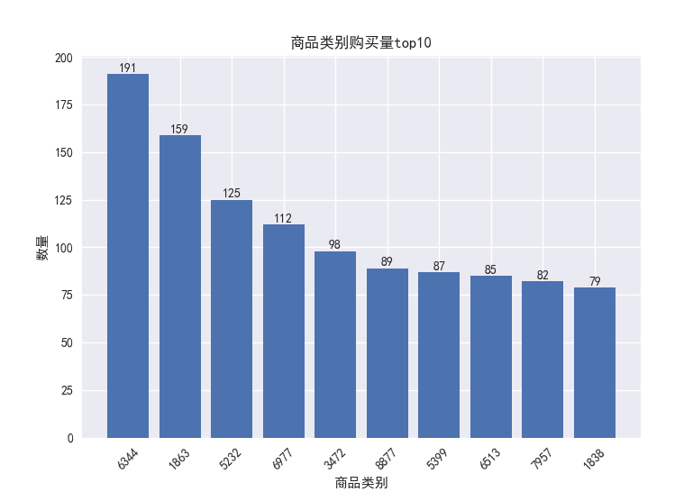

 - 这一个月内top10商品类别的平均购买量在110左右。
 - 分析与建议：
    - 可对这些商品类别的类别特征进行分析，看是否有相似特征，若有，寻找有这些相似特征但销量一般的商品增加推广，可能带来销量的进一步提升；
    - 对这些类别中的热销商品增加促销和推广，观察热销商品是否有进一步提升销量的空间；
    - 将这些类别中的热销商品与同类别中的销量低的商品销售捆绑，通过降价或者满减促销的方式鼓励消费者进行组合购买，以此促进用户购买。

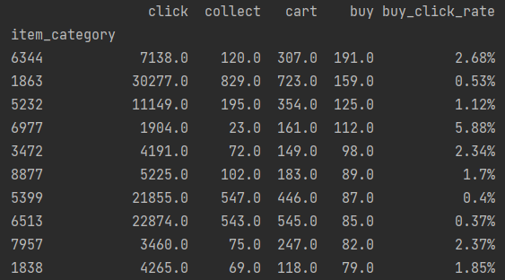
 - 购买量前十的商品类别中，大部分商品类别的转化率仅在0-3%。
 - 分析与建议：转化率较低的一个重要原因在于用户存在货比三家的心理，但最终往往选择一个商品进行购买，所以导致整个类别的转化率较低。提高类别的转化率关键在于推荐与搜索的精准性，具体表现在：
    - 推荐的商品是用户感兴趣的商品，即推荐算法的精准 
    - 推荐的商品应当是同类商品中较为优质的商品，有较高的商品评价，避免用户过多的比较、点击不同的商品。
    - 优化用户购买同类商品的比较流程，增加同类商品信息比较与搜索的功能，减少不必要的重复点击查询。这样可以减少用户做出购买决策的时间，提升用户的购买体验。  
###     5.3.4 帕累托分析
对商品类别和商品进行帕累托分析，找出贡献前80%销量的商品类别和商品，往往这些商品类别和商品占总体的比重不到20%，可以将运营推广的重点放在这部分商品类别和商品中。
####    5.3.4.1 帕累托分析：类别分析

####    5.3.4.2 帕累托分析：商品分析
```
def pareto_analysis():
    data_top10buynum_category = pd.DataFrame()
    data_top10buynum_category["buy_num"] = data_analysis[data_analysis["behavior_type"] == "buy"].groupby("item_category")["item_category"].count().sort_values(ascending=False)
    data_top10buynum_category["buy_num_cumsum"] = data_top10buynum_category["buy_num"].expanding().sum()
    max_num = data_top10buynum_category["buy_num_cumsum"].max()
    buynumtop80percent_categorynum = data_top10buynum_category[data_top10buynum_category["buy_num_cumsum"]/max_num < 0.8]["buy_num_cumsum"].count()
    print("贡献前百分之八十销量的类别总数：" + str(buynumtop80percent_categorynum))
    rate = buynumtop80percent_categorynum / data_analysis["item_category"].nunique()
    print("贡献前百分之八十销量的类别占比：" + str(round(rate, 3)))

    data_top10buynum_item = pd.DataFrame()
    data_top10buynum_item["buy_num"] = data_analysis[data_analysis["behavior_type"] == "buy"].groupby("item_id")["item_id"].count().sort_values(ascending=False)
    data_top10buynum_item["buy_num_cumsum"] = data_top10buynum_item["buy_num"].expanding().sum()
    max_num = data_top10buynum_item["buy_num_cumsum"].max()
    buynumtop80percent_itemnum = data_top10buynum_item[data_top10buynum_item["buy_num_cumsum"]/max_num < 0.8]["buy_num_cumsum"].count()
    print("贡献前百分之八十销量的商品总数："+str(buynumtop80percent_itemnum))
    rate = buynumtop80percent_itemnum/data_analysis["item_id"].nunique()
    print("贡献前百分之八十销量的商品占比："+str(round(rate, 3)))
```

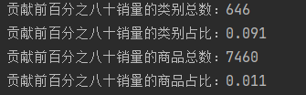

 - 贡献前80%销量的类别占比9.1%，贡献前80%销量的商品占比1.1%
 - 分析与建议：根据二八法则，运营活动针对这1.1%的商品和9.1%的商品类别应当分配更多的资源，以期获得显著的销量提升效果。
# 6. 总结与建议

 - 平台基本情况
   - 在统计的一个月里，网站总访问量100万次，总访客数9918人，日均访问量约3万次，人均访问量101次。复购率49%，近1/4用户会选择回购，验证了产品与平台的价值，跳出率0.97%，说明平台的用户流失极少，平台商品与广告对用户具有吸引力，人们愿意花费时间在平台上浏览、选购商品。（注：时期包含双12可能导致各指标较日常时期有所提升）
 - 流量维度建议
   - 用户的活跃时间有规律。在18点-22点，用户的访问量、各项行为指标明显上升，故而可以在此期间多进行推送、直播带货、促销活动等。
   - 在流量转化方面，收藏、加购、购买的点击转化率均不超过3%，转化率较低，可考虑推送机制是否精准、商品质量是否有待提高、定价是否相对同行更高、售前服务质量是否有待提高等维度来定位问题。
 - 用户维度建议
   - 用户的短期留存率仍有较大的提升空间，可以通过有奖签到、限时优惠券等方式提高用户粘性；用户的长期留存率相较于短期留存率下降平缓，较为稳定，可以通过增加推送、发放优惠券等方式提升长期中用户对平台的忠诚度。
   - 在用户的购买路径中，直接购买以及点击-购买是主要的购买方式，虽然收藏与加购的用户数量不低但转为购买量的占比很低，应当针对用户收藏、加购的商品加大力度发放优惠券、推送相关促销活动等促进用户对收藏加购商品的购买。
   - 据RFM模型对用户进行了分类，针对不同价值的用户采取不同不同的运营策略，进行更为精细化的运营，提升重要价值用户占比，减少重要挽留用户占比。
 - 商品维度建议
   - 针对购买量前列的商品，依据转化率所在区间的不同，采取不同的运营策略。
   - 点击量前列的商品，转化率普遍很低，通过推荐算法、流量推广、商品价格与质量等维度定位问题原因。
   - 对类别的点击购买转化率较低的问题，可以尝试从精准推荐、优质推送、优化同类别商品的搜索流程等维度改善。
   - 结合帕累托分析的结果，运营活动应对销量贡献大的商品或类别给予更多的资源倾斜。
