# 1. 项目背景
# 2. 数据集介绍
# 3. 分析方法与分析思虑
# 4. 数据清洗
##    4.1 数据导入

```
import pandas as pd
data_analysis = pd.read_csv("data/电子产品销售分析.csv", index_col=0)
```
##    4.2 数据类型确定

```
data_analysis["event_time"] = data_analysis["event_time"].apply(lambda x: x[0:-4])
data_analysis["event_time"] = pd.to_datetime(data_analysis["event_time"])
data_analysis["category_id"] = data_analysis["category_id"].astype("int64")
data_analysis["order_id"] = data_analysis["order_id"].astype("object")
data_analysis["product_id"] = data_analysis["product_id"].astype("object")
data_analysis["user_id"] = data_analysis["user_id"].astype("int64")
data_analysis["age"] = data_analysis["age"].astype("int64")
print(data_analysis.head())
print(data_analysis.info())
```


##    4.3 缺失值处理
###       4.3.1 查看缺失值
```
print(data_analysis.isnull().sum())
```

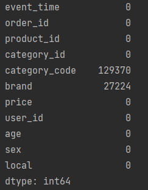

###       4.3.2 填充缺失值
```
"""
    由于这两个类别是离散型的，所以一般办法根据上下文填充不能确定
    但是对于brand列的缺失值我想是否根据price相近用来确定brand的值，但是目前还没有想到好的办法，后面有思路了再做
    category_code可以根据brand来确定category_code的值
"""
data_analysis["brand"] = data_analysis["brand"].fillna("R")
data_analysis["category_code"] = data_analysis["category_code"].fillna("无")
print(data_analysis.isnull().sum())
```

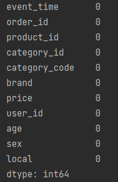

##    4.4 异常值处理

```
print(data_analysis.describe(include="all", datetime_is_numeric=True))
# 通过查看发现：有一组时间数据1970-01-01的数据似乎是异常值，后续将会把它删除掉。
print(data_analysis[data_analysis["event_time"] < "2000-01-01"])
data_analysis.drop(data_analysis[data_analysis["event_time"] < "2000-01-01"].index, inplace=True, axis=0)
```

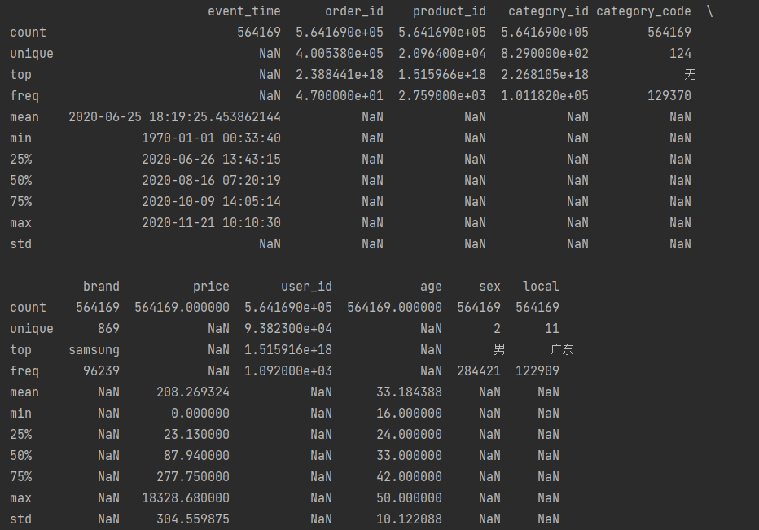

##    4.5 重复值处理
###       4.5.1 查看重复值
```
print(data_analysis[data_analysis.duplicated()])
```

###       4.5.2 查看重复值的具体情况
```
print(data_analysis[data_analysis["order_id"] == 2388440981134610187])
"""
通过查看具体数据我们发现同一笔订单，同一个用户购买的同一个商品，由于会有订单出现购买相同商品多次的情况，
所以我们判断这可能不是重复值，所以暂时不对这个做删除处理
"""
```


##    4.6 辅助列处理

```
data_1 = data_analysis.groupby(['order_id', 'product_id']).agg(buy_count=('user_id', 'count'))
data_analysis = pd.merge(data_analysis, data_1, how='inner', on=['order_id', 'product_id'])
```
 - groupby()中的agg方法用处很大
 - merge()方法可以按照内连接，外连接的方法进行数据表的合并，用处很大

##    4.7 保存清洗后的数据
```
data_analysis.to_csv("data/data_clean.csv")
```
# 5. 数据分析
```
data_analysis = pd.read_csv("data/data_clean.csv", index_col=0)
print(data_analysis.info())
```

##  5.1 销售额分析
###     5.1.1 GMV
###     5.1.2 GMV增长曲线  
###     5.1.3 销售额增长曲线 （按月）
```
def sales_analysis():
    #     5.1.1 GMV
    GMV = round(data_analysis["price"].sum(), 2)
    print(GMV)
    #     5.1.2 GMV增长曲线
    # 日销量、销售额
    data_sales = data_analysis.groupby("date").agg(销量=('buy_count', 'sum'), 销售额=('amount', 'sum')).reset_index()
    # 累积销量，销售额
    data_sales["累积销量"] = data_sales["销量"].cumsum()
    data_sales["累积销售额"] = data_sales["销售额"].cumsum()
    # 日销量环比增长,环比增长率,日销售额环比增长，环比增长率
    data_sales["日销量增长"] = data_sales["销量"].diff()
    data_sales["日销量增长率"] = round(data_sales["销量"].pct_change()*100, 2)
    data_sales["日销售额增长"] = data_sales["销售额"].diff()
    data_sales["日销售额增长率"] = round(data_sales["销售额"].pct_change()*100, 2)
    print(data_sales)
    # 画累积销量和销售额折线图
    # 2. 准备数据
    x_data = data_sales["date"].apply(lambda x: x[-5:]).to_list()
    y_data_volume = data_sales["累积销量"].tolist()
    y_data = [round(x/10000, 2) for x in data_sales["累积销售额"]]
    # 3. 配置属性
    line = (
        Line()
        .add_xaxis(x_data)
        .add_yaxis("累积销售额（万）", y_data, yaxis_index=0, label_opts=opts.LabelOpts(is_show=False))
        .extend_axis(yaxis=opts.AxisOpts(axislabel_opts=opts.LabelOpts(formatter="{value} 件")))  # 添加y轴
        .set_global_opts(
            title_opts=opts.TitleOpts(title="销售额累积增长"),  # 设置标题
            tooltip_opts=opts.TooltipOpts(trigger="axis", axis_pointer_type="cross"),  # 显示图例
            datazoom_opts=opts.DataZoomOpts(is_show=True),  # 显示滑动组件
        )
    )
    line1 = (
        Line()
        .add_xaxis(x_data)
        .add_yaxis("累积销量（件）", y_data_volume, yaxis_index=1, label_opts=opts.LabelOpts(is_show=False))
        .extend_axis(yaxis=opts.AxisOpts(axislabel_opts=opts.LabelOpts(formatter="{value} 件"), interval=5000))  # 添加y轴
    )
    line.overlap(line1)  # 将两个图形叠加
    # 4. 生成文件
    # line.render("data/template/sales_analysis_line.html")

    #     5.1.3 销售额增长曲线 （按月）
    data_sales_month = data_analysis.groupby("month").agg(GVM=('amount', 'sum')).reset_index()
    data_sales_month["环比增长"] = data_sales_month["GVM"].diff()
    data_sales_month["环比增长率"] = data_sales_month["GVM"].pct_change()*100
    print(data_sales_month)
    # 画图-销售额环比增长对比图
    bar = (
        Bar()
        .add_xaxis([str(x)+'月' for x in data_sales_month["month"]])
        .add_yaxis("月_GMV(万)", [round(x/10000, 2) for x in data_sales_month["GVM"]], label_opts=opts.LabelOpts(is_show=False))
        .add_yaxis("环比增长(万)", [round(x/10000, 2) for x in data_sales_month["环比增长"]], label_opts=opts.LabelOpts(is_show=False))
        .extend_axis(yaxis=opts.AxisOpts(axislabel_opts=opts.LabelOpts(formatter="{value} %"),))
        .set_global_opts(
            tooltip_opts=opts.TooltipOpts(trigger="axis", axis_pointer_type="cross"),
            title_opts=opts.TitleOpts(title="销售额环比增长对比图"),
        )
    )
    line_month = (
        Line()
        .add_xaxis([str(x)+"月" for x in data_sales_month["month"]])
        .add_yaxis("环比增长率", [round(x, 2) for x in data_sales_month["环比增长率"]], yaxis_index=1, label_opts=opts.LabelOpts(is_show=False))
        .extend_axis(yaxis=opts.AxisOpts(axislabel_opts=opts.LabelOpts(formatter="{value} %"), interval=500))
    )
    bar.overlap(line_month)
    # 将制作的所有图表整合到一个页面中
    page = Page(layout=Page.DraggablePageLayout, page_title="基于Pyecharts的销售数据大屏")
    # page.add(bar, line)
    # page.render("sales_analysis.html")
    page.save_resize_html('data/template/sales_analysis.html', cfg_file='data/template/chart_config.json', dest='data/template/5.1销售额分析-可视化大屏.html')
```


##  5.2 销量分析
###     5.2.1 每月销量
```
def sales_volume():
    #     5.2.1 每月销量
    sales_data = data_analysis.groupby("month").agg(销量=("buy_count", "sum")).reset_index()
    sales_data["环比增长"] = sales_data["销量"].diff()
    sales_data["环比增长率"] = sales_data["销量"].pct_change()*100
    print(sales_data)
    # 画图-销量环比增长对比图
    bar = (
        Bar()
        .add_xaxis([str(x)+"月" for x in sales_data["month"]])
        .add_yaxis("销量", sales_data["销量"].to_list(), label_opts=opts.LabelOpts(is_show=False))
        .add_yaxis("环比增长", sales_data["环比增长"].to_list(), label_opts=opts.LabelOpts(is_show=False))
        .extend_axis(yaxis=opts.AxisOpts(axislabel_opts=opts.LabelOpts(formatter="{value} 件")))
        .set_global_opts(
            title_opts=opts.TitleOpts(title="销量环比增长对比图"),
            tooltip_opts=opts.TooltipOpts(trigger="axis")
        )
    )
    line = (
        Line()
        .add_xaxis([str(x)+"月" for x in sales_data["month"]])
        .add_yaxis("环比增长率", [round(x, 2) for x in sales_data["环比增长率"]], yaxis_index=1, label_opts=opts.LabelOpts(is_show=False))
        .extend_axis(yaxis=opts.AxisOpts(axislabel_opts=opts.LabelOpts(formatter="{value} %")))
    )
    bar.overlap(line)
    bar.render("data/template/5.2-sales_volume.html")
```

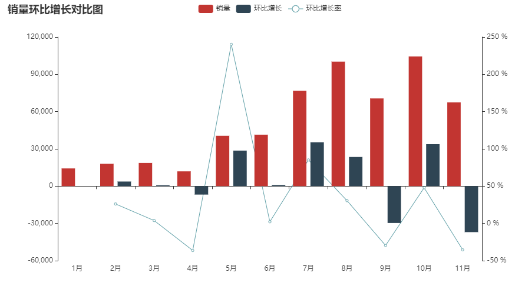

###     5.2.2 计算销量前10商品  销量/销售额/占比
```
def sales_top(cloums):
        """
        对传入的类进行分组，并求出销量、销售额、销量占比、销量额占比的情况
        :param cloums: 需要计算的类名
        :return: 求出分组前top10
        """
        name = data_analysis.groupby(cloums).agg(销量=("buy_count", "sum"), 销售额=("amount", "sum")).sort_values("销量", ascending=False).reset_index()
        # sales_goods["销量占比"] = sales_goods["销量"].apply(lambda x: x/sales_goods["销量"].sum()*100)
        # sales_goods["销售额占比"] = sales_goods["销售额"].apply(lambda x: x/sales_goods["销售额"].sum()*100)
        # 用下面这一种写法运用的是numpy的广播机制，运行效率比使用apply遍历每一行数据更快。所以能用广播机制的时候尽量实用广播机制
        name["销量占比"] = name["销量"] / (name["销量"].sum())*100
        name["销售额占比"] = name["销售额"] / (name["销售额"].sum())*100
        print(f"销量前10商品:\n{name.head(10)}")
sales_top("product_id")
```
###     5.2.3 计算销量前10类别  销量/销售额/占比
```
    sales_top("category_code")
```
###     5.2.4 计算销量前10品牌  销量/销售额/占比  
```
    sales_top("brand")
```
###     5.2.5 计算销量第一的品牌人群特征
```

```
##  5.3 用户分析
```
def user_analysis():
    #     5.3.1 计算用户年龄分布  基数/占比
    user_age = data_analysis.groupby("age").agg(人数=("user_id", "nunique")).reset_index()
    bins1 = [15, 20, 25, 30, 35, 40, 45, 50]
    user_age['age_bin'] = pd.cut(user_age.age, bins=bins1)
    print(user_age)
    cut_age = user_age.groupby("age_bin").agg(人数=("人数", "sum")).reset_index()
    print(cut_age)
    # 画图-年龄分布饼图
    x_age = [str(x)[1:3]+"-"+str(x)[-3:-1]+"岁" for x in cut_age["age_bin"]]
    y_age = cut_age["人数"].to_list()
    age_pie = (
        Pie()
        .add("年龄分布", [list(z) for z in zip(x_age, y_age)])
        .set_global_opts(
            title_opts=opts.TitleOpts(title="年龄分布图"),
            legend_opts=opts.LegendOpts(orient="vertical", pos_top="15%", pos_left="2%"),
        )
        .set_series_opts(label_opts=opts.LabelOpts(formatter="{a}:{b}\n{d}%"))
    )
    age_pie.render("data/template/5.3-user_age_pie.html")
    #     5.3.2 计算用户性别分布  基数/占比
    user_sex = data_analysis.groupby("sex").agg(人数=("user_id", "nunique")).reset_index()
    print(user_sex)
    sex_pie = (
        Pie()
        .add("性别分布",
             [list(z) for z in zip(user_sex["sex"], user_sex["人数"])],
             center=["30%", "40%"],
             radius=[70, 110],
             label_opts=opts.LabelOpts(position="middle")
        )
        .set_global_opts(
            title_opts=opts.TitleOpts(title="性别分布"),
            legend_opts=opts.LegendOpts(orient="vertical", pos_top="15%", pos_left="5%"),
        )
        .set_series_opts(label_opts=opts.LabelOpts(formatter="{b}\n{d}%"))
    )
    sex_pie.render("data/template/5.3-user_sex_pie.html")
    #     5.3.3 计算用户地区分布  基数/占比 / 各省用户的占比
    eare_data = data_analysis.groupby("local").agg(人数=("user_id", "nunique")).sort_values("人数", ascending=False).reset_index()
    print(eare_data)
    eare_pie = (
        Pie()
        .add("地区分布", [list(z) for z in zip(eare_data["local"], eare_data["人数"])],
             center=["40%", "40%"],
             radius=[50, 100],
             label_opts=opts.LabelOpts(
                 position="outside",
                 formatter="{a|{a}}{abg|}\n{hr|}\n {b|{b}: }{c}  {per|{d}%}  ",
                 background_color="#eee",
                 border_color="#aaa",
                 border_width=1,
                 border_radius=4,
                 rich={
                     "a": {"color": "#999", "lineHeight": 22, "align": "center"},
                     "abg": {
                         "backgroundColor": "#e3e3e3",
                         "width": "100%",
                         "align": "right",
                         "height": 22,
                         "borderRadius": [4, 4, 0, 0],
                     },
                     "hr": {
                         "borderColor": "#aaa",
                         "width": "100%",
                         "borderWidth": 0.5,
                         "height": 0,
                     },
                     "b": {"fontSize": 16, "lineHeight": 33},
                     "per": {
                         "color": "#eee",
                         "backgroundColor": "#334455",
                         "padding": [2, 4],
                         "borderRadius": 2,
                     },
                 },
             ),
        )
        .set_global_opts(
            title_opts=opts.TitleOpts(title="地区分布"),
            legend_opts=opts.LegendOpts(orient="vertical", pos_top="15%", pos_left="0%"),
        )
    )
    eare_pie.render("data/template/5.3-user_eare_pie.html")
    #     5.3.4 销售额贡献曲线(找出头部客户重点维护，二八定律-找出累计贡献销售额80%的那批用户)
    user_sales = data_analysis.groupby("user_id").agg(消费金额=("amount", "sum")).sort_values("消费金额", ascending=False).reset_index()
    user_sales["user_id"] = user_sales["user_id"].astype("int64")
    user_sales["累积消费"] = user_sales["消费金额"].cumsum()
    user_sales["消费额占比"] = user_sales["累积消费"]/user_sales["累积消费"].max()*100
    user_sales["累积人数"] = user_sales["消费金额"].rank(ascending=False).astype("int64")
    user_sales["人数占比"] = user_sales["累积人数"]/user_sales["累积人数"].max()*100
    print(user_sales.head(10))
    # 画图-销售额贡献曲线
    user_sales_line = (
        Line()
        .add_xaxis([round(x, 2) for x in user_sales["人数占比"][::1000]])
        .add_yaxis("累积消费", [round(x, 2) for x in user_sales["消费额占比"][::1000]], label_opts=opts.LabelOpts(is_show=False))
        .set_global_opts(
            title_opts=opts.TitleOpts(title="销售额贡献曲线"),
            legend_opts=opts.LegendOpts(is_show=False),
            datazoom_opts=opts.DataZoomOpts(is_show=True),
            tooltip_opts=opts.TooltipOpts(trigger="axis", axis_pointer_type="cross"),
        )
    )
    user_sales_line.render("data/template/5.3-user_sales_line.html")
    #     5.3.5 客户消费金额的分位数（二八定律）
    user_2_8 = user_sales[user_sales["消费额占比"] < 80].reset_index()
    print(f'前{round(user_2_8["人数占比"].max(), 2)}%的用户贡献了80%的销售额，共{user_2_8.shape[0]}人,这些客户重点维护')
    #     5.3.6 客户总消费金额的分位数
    user_loudou = pd.DataFrame(user_sales["消费金额"].describe(percentiles=[0.01, 0.1, 0.25, 0.5, 0.75, 0.9, 0.99])).reset_index()
    user_loudou["消费金额"] = round(user_loudou["消费金额"], 2)
    user_loudou_data = [list(z) for z in zip(user_loudou["index"], user_loudou["消费金额"])][4:-1]
    """还未写完漏斗模型"""

    #     5.3.7 客户消费金额的分布
    bins2 = [0, 10, 20, 50, 100, 200, 500, 1000, 2000, 5000, 10000, 100000, 1000000]
    user_sales["cut_user_sales"] = pd.cut(user_sales["消费金额"], bins=bins2)
    cut_user_sales = user_sales.groupby("cut_user_sales").agg(人数=("cut_user_sales", "count")).reset_index()
    print(cut_user_sales)
    # 画图-客户消费金额分布柱状图
    user_sales_bar = (
        Bar()
        .add_xaxis([str(x)+"元" for x in cut_user_sales["cut_user_sales"]])
        .add_yaxis("人数", cut_user_sales["人数"].tolist())
        .set_global_opts(
            title_opts=opts.TitleOpts(title="客户消费金额分布")
        )
    )
    user_sales_bar.render("data/template/5.3-user_sales_bar.html")

    #     5.3.8 单笔订单消费金额的分布
    bin3 = [0, 10, 20, 50, 100, 200, 500, 1000, 2000, 5000, 10000, 20000]
    data_analysis["price_cut"] = pd.cut(data_analysis["price"], bins=bin3)
    order_sales = data_analysis.groupby("price_cut").agg(人数=("price", "count")).reset_index()
    print(order_sales)
    # 画图-单笔订单消费金额分布
    order_sales_bar = (
        Bar()
        .add_xaxis([str(x)+"元" for x in order_sales["price_cut"]])
        .add_yaxis("人数", order_sales["人数"].tolist())
        .set_global_opts(
            title_opts=opts.TitleOpts(title="单笔订单消费金额分布"),
            xaxis_opts=opts.AxisOpts(axislabel_opts=opts.LabelOpts(rotate=25)),
        )
    )
    order_sales_bar.render("data/template/5.3-order_sales_bar.html")
    #     5.3.9 新客老客的销售额与销量对比
```

###     5.3.1 计算用户年龄分布  基数/占比

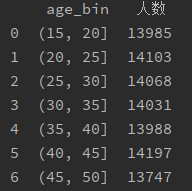


###     5.3.2 计算用户性别分布  基数/占比


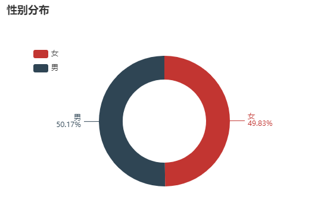

###     5.3.3 计算用户地区分布  基数/占比 / 各省用户的占比

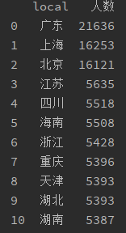

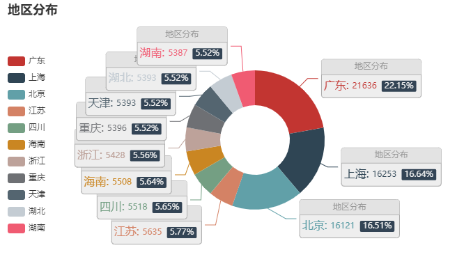

###     5.3.4 销售人贡献曲线(找出头部客户重点维护，二八定律-找出累计贡献销售额80%的那批用户)

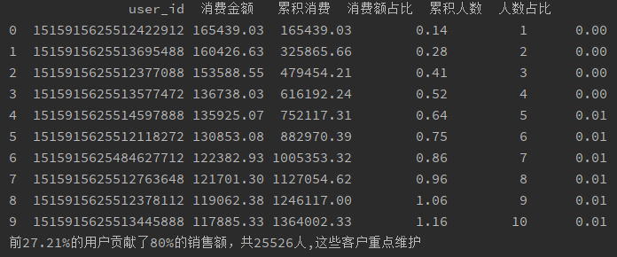

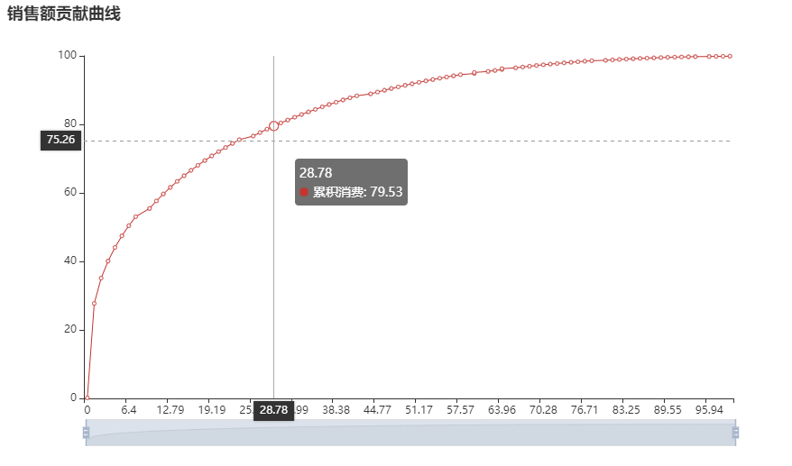

###     5.3.5 客户消费金额的分位数

前27.21%的用户贡献了80%的销售额，共25526人,这些客户重点维护

###     5.3.6 客户总消费金额的分位数

###     5.3.7 客户总消费金额的分布

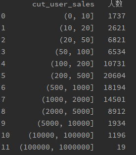

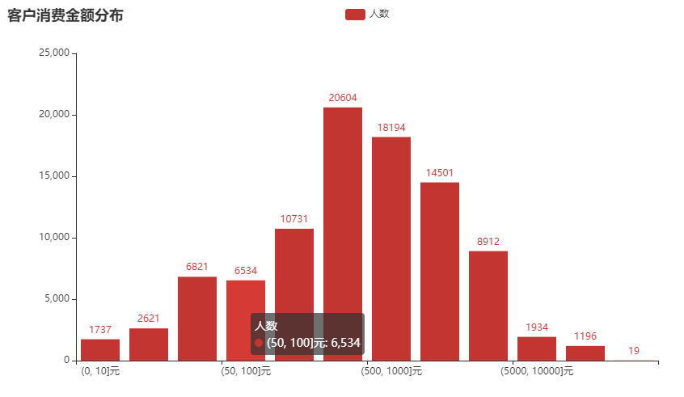

###     5.3.8 单笔订单消费金额的分布


###     5.3.9 新客老客的销售额与销量对比

##  5.4 用户评分

```
def user_rating():
    user_data = data_analysis.groupby("user_id").agg(订单数量=("buy_count", "sum"), 订单总额=("amount", "sum")).reset_index()
    user_data["客单价"] = round(user_data["订单总额"] / user_data["订单数量"], 2)
    # 获取其他特征
    user_data_f = data_analysis[["user_id", "age", "sex", "local"]]
    # 合并数据
    user_data = pd.merge(user_data, user_data_f, how="inner", on="user_id").drop_duplicates("user_id").reset_index()
    # 年龄分段
    bin_age = [15, 20, 25, 30, 35, 40, 45, 50]
    user_data["age_bin"] = pd.cut(user_data["age"], bins=bin_age)
    print(user_data)
    #     5.4.1 年龄区分 订单数量/订单总额/单均价
    user_data_age = user_data.groupby("age_bin").agg(订单数量=("订单数量", "sum"), 订单金额=("订单总额", "sum"), 客均单量=("订单数量", "mean"), 客单价=("客单价", "mean")).reset_index()
    """
    计算购买力评分：
        这里查用最简单的归一化进行数值评分，如果觉得某一项更重要，可以给每一项加一个权重系数，
        评分这里需要对业务十分了解，结合相关经验进行讨论而定。
        评分系统对业务十分重要，他决定一个客户或公司的重点，所以更需要细细琢磨    
    """
    def score(data):
        score_num = round((data-data.min()) / (data.max()-data.min()), 2)
        return score_num
    user_data_age["分数"] = score(user_data_age["订单数量"])+score(user_data_age["订单金额"])+score(user_data_age["客均单量"])+score(user_data_age["客单价"])
    user_data_age["购买力rank"] = user_data_age["分数"].rank(ascending=False)
    user_data_age = user_data_age.sort_values(by="购买力rank")
    print(user_data_age)
    #     5.4.2 用户性别分布中  销量/销售额/
    user_data_sex = user_data.groupby("sex").agg(订单数量=("订单数量", "sum"), 订单金额=("订单总额", "sum"), 客均单量=("订单数量", "mean"), 客单价=("客单价", "mean")).reset_index()
    print(user_data_sex)
    #     5.4.3 用户地区分布中  销量/销售额/
    user_data_local = user_data.groupby("local").agg(订单数量=("订单数量", "sum"), 订单金额=("订单总额", "sum"), 客均单量=("订单数量", "mean"), 客单价=("客单价", "mean")).reset_index()
    user_data_local["购买力分数"] = score(user_data_local["订单数量"])+score(user_data_local["订单金额"])+score(user_data_local["客均单量"])+score(user_data_local["客单价"])
    user_data_local["购买力rank"] = user_data_local["购买力分数"].rank(ascending=False)
    user_data_local = user_data_local.sort_values(by="购买力rank")
    print(user_data_local)
```

###     5.4.1 用户年龄分布中  销量/销售额/


###     5.4.2 用户性别分布中  销量/销售额/


###     5.4.3 用户地区分布中  销量/销售额/

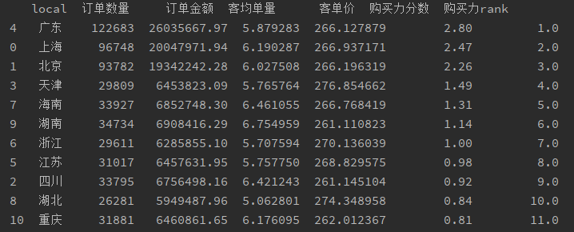
##  5.5 时间分析
###     5.5.4 每月新客/老客人数分析  
###     5.5.5 每月新用户/老用户 销售额环比

```
def time_analysis():
    #     5.5.1 客户消费周期分布情况
    def time_analysis_data(x_cloums):
        time_data = data_analysis.groupby(x_cloums).agg(销量=("buy_count", "sum"), 销售额=("amount", "sum")).reset_index()
        time_data["销量环比增长"] = time_data["销量"].diff()
        time_data["销量环比增长率"] = round(time_data["销量"].pct_change(), 4)
        time_data["销售额环比增长"] = time_data["销售额"].diff()
        time_data["销售额环比增长率"] = round(time_data["销售额"].pct_change(), 4)
        return time_data
    date_data = time_analysis_data("date")
    month_data = time_analysis_data("month")
    day_data = time_analysis_data("day")
    hour_data = time_analysis_data("hour")

    # 画图-销售额与销量变化情况
    date_line = (
        Line()
        .add_xaxis(date_data["date"].to_list())
        .add_yaxis("销量", date_data["销量"].to_list(), yaxis_index=1, label_opts=opts.LabelOpts(is_show=False))
        .add_yaxis("销售额(万)", [round(x/10000, 2) for x in date_data["销售额"]], label_opts=opts.LabelOpts(is_show=False))
        .extend_axis(yaxis=opts.AxisOpts(axislabel_opts=opts.LabelOpts(formatter="{value} 件")))
        .set_global_opts(
            title_opts=opts.TitleOpts(title="销售额与销量变化情况"),
            tooltip_opts=opts.TooltipOpts(trigger="axis", axis_pointer_type="cross"),
            yaxis_opts=opts.AxisOpts(name="销售额(单位:万)", axislabel_opts=opts.LabelOpts(formatter="{value} 万")),
            datazoom_opts=opts.DataZoomOpts(is_show=True)
        )
    )
    #       1. 月销量/销售额分布
    # 画图-销售额与销量(月)变化情况
    month_line = (
        Bar()
        .add_xaxis(month_data["month"].to_list())
        .add_yaxis("销量", month_data["销量"].to_list(), yaxis_index=1, label_opts=opts.LabelOpts(is_show=False))
        .add_yaxis("销售额(万)", [round(x/10000, 2) for x in month_data["销售额"]], label_opts=opts.LabelOpts(is_show=False))
        .extend_axis(yaxis=opts.AxisOpts(axislabel_opts=opts.LabelOpts(formatter="{value} 件")))
        .set_global_opts(
            title_opts=opts.TitleOpts(title="销售额与销量变化情况"),
            tooltip_opts=opts.TooltipOpts(trigger="axis", axis_pointer_type="cross"),
            yaxis_opts=opts.AxisOpts(name="销售额(单位:万)", axislabel_opts=opts.LabelOpts(formatter="{value} 万")),
            datazoom_opts=opts.DataZoomOpts(is_show=True)
        )
    )
    #       2. 日销量/销售额分布
    # 画图-销售额(日)变化情况
    day_line = (
        Bar()
        .add_xaxis(day_data["day"].to_list())
        .add_yaxis("销售额(万)", [round(x/10000, 2) for x in day_data["销售额"]], label_opts=opts.LabelOpts(is_show=False))
        .add_yaxis("销售额环比增长(万)", [round(x/10000, 2) for x in day_data["销售额环比增长"]], label_opts=opts.LabelOpts(is_show=False))
        .extend_axis(yaxis=opts.AxisOpts(axislabel_opts=opts.LabelOpts(formatter="{value} %")))
        .set_global_opts(
            title_opts=opts.TitleOpts(title="销售额与销量变化情况"),
            tooltip_opts=opts.TooltipOpts(trigger="axis", axis_pointer_type="cross"),
            datazoom_opts=opts.DataZoomOpts(is_show=True)
        )
    )
    day_line1 = (
        Line()
        .add_xaxis(day_data["day"].to_list())
        .add_yaxis("销售额环比增长率(%)", [round(x*100, 2) for x in day_data["销售额环比增长率"]], yaxis_index=1, label_opts=opts.LabelOpts(is_show=False))
    )
    day_line.overlap(day_line1)

    #       3. 时销量/销售额分布
    # 画图-销售额（小时）变化情况
    hour_bar = (
        Bar()
        .add_xaxis(hour_data["hour"].to_list())
        .add_yaxis("销售额(万)", [round(x/10000, 2) for x in hour_data["销售额"]], label_opts=opts.LabelOpts(is_show=False))
        .add_yaxis("销售额环比增长(万)", [round(x/10000, 2) for x in hour_data["销售额环比增长"]], label_opts=opts.LabelOpts(is_show=False))
        .extend_axis(yaxis=opts.AxisOpts(axislabel_opts=opts.LabelOpts(formatter="{value} %")))
        .set_global_opts(
            title_opts=opts.TitleOpts(title="销售额与销量变化情况"),
            tooltip_opts=opts.TooltipOpts(trigger="axis", axis_pointer_type="cross"),
            datazoom_opts=opts.DataZoomOpts(is_show=True)
        )
    )
    hour_bar1 = (
        Line()
        .add_xaxis(hour_data["hour"].to_list())
        .add_yaxis("销售额环比增长率(%)", [round(x*100, 2) for x in hour_data["销售额环比增长率"]], yaxis_index=1, label_opts=opts.LabelOpts(is_show=False))
    )
    hour_bar.overlap(hour_bar1)

    #     5.5.2 每月新客/老客人数分析
    #     5.5.3 每月新用户/老用户 销售额环比
    # 将所有画图集中到一起
    page = (
        Page(page_title="基于Pyecharts的时间分析数据大屏")
        .add(date_line, month_line, day_line, hour_bar)
        .render("data/template/5.5-时间分析.html")
    )
```
###     5.5.1 客户消费周期分布情况


###     5.5.2 按日销量/销售额分布

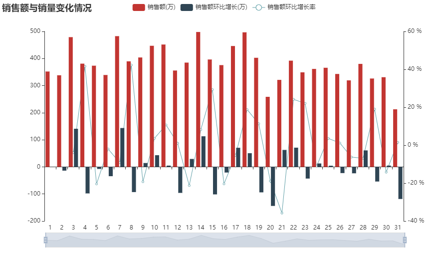

###     5.5.3 按小时分析


##  5.6 RFM模型分析

```
def RFM_model():
    rfm_data = data_analysis.groupby("user_id").agg(最后消费时间=("date", "max"), F=("date", "count"), M=("amount", "sum")).reset_index()
    rfm_data["最后消费时间"] = pd.to_datetime(rfm_data["最后消费时间"])
    rfm_data["R"] = rfm_data["最后消费时间"].max()-rfm_data["最后消费时间"]
    rfm_data["R"] = rfm_data["R"].dt.days
    # 对数据进行评分
    print(rfm_data.describe())

    def r_score(x):
        if x < 60:
            return 5
        elif 60 <= x < 90:
            return 4
        elif 90 <= x < 110:
            return 3
        elif 110 <= x < 130:
            return 2
        else:
            return 1

    def f_score(x):
        if x == 1:
            return 1
        elif x == 2:
            return 2
        elif x == 3:
            return 3
        elif x == 4:
            return 4
        else:
            return 5

    def m_score(x):
        if x < 100:
            return 1
        elif 100 <= x < 400:
            return 2
        elif 400 <= x < 1000:
            return 3
        elif 1000 <= x < 5000:
            return 4
        else:
            return 5
    rfm_data["r_score"] = rfm_data["R"].map(r_score)
    rfm_data["f_score"] = rfm_data["F"].map(f_score)
    rfm_data["m_score"] = rfm_data["M"].map(m_score)
    # 分组
    r_mean = rfm_data["r_score"].mean()
    f_mean = rfm_data["f_score"].mean()
    m_mean = rfm_data["m_score"].mean()
    rfm_data["r_num"] = rfm_data["r_score"].apply(lambda x: '0' if x < r_mean else '1')
    rfm_data["f_num"] = rfm_data["f_score"].apply(lambda x: '0' if x < f_mean else '1')
    rfm_data["m_num"] = rfm_data["m_score"].apply(lambda x: '0' if x < m_mean else '1')
    rfm_data["label"] = rfm_data.r_num + rfm_data.f_num + rfm_data.m_num
    dic_label = {
        '111': '重要价值客户',
        '011': '重要保持客户',
        '101': '重要挽留客户',
        '001': '重要发展客户',
        '110': '一般价值客户',
        '010': '一般保持客户',
        '100': '一般挽留客户',
        '000': '一般发展客户'
    }
    rfm_data["label"] = rfm_data["label"].map(dic_label)
    print(rfm_data["label"].value_counts())
    return rfm_data
```
##  5.7 用户画像
```
def user_tags():
    """
    第一步：提取特征
        基本信息：姓名，年龄， 性别， 职业，地址， 生日， 学校，学历， 等
        行为特征：购买偏好，消费频率， 消费习惯， 近期消费次数， 近期消费金额， 渠道使用习惯，支付使用习惯， 优惠券使用习惯
        其他特征：心里特征， 生活态度， 用户价值， 等
    :return:
    """
    user_group = data_analysis.groupby("user_id")
    # 基本信息----年龄、性别、城市
    user_p5 = data_analysis[["user_id", "age", "sex", "local"]].drop_duplicates("user_id", keep="first")
    # 行为特征----购物最常时间，最常购买商品，最常购买品牌，用户价值。
    user_p2 = user_group['hour'].agg(lambda x: x.mode().values[0])  # 最常用的购物时间
    user_p3 = user_group['category_code'].agg(lambda x: x.mode().values[0])  # 最喜欢购买的商品类别
    user_p4 = user_group['brand'].agg(lambda x: x.mode().values[0])  # 最喜欢购买的商品品牌
    user_data = pd.concat([user_p2, user_p3, user_p4], axis=1).reset_index()
    user_data[["R", "F", "M", "label", "最后消费时间"]] = RFM_model()[["R", "F", "M", "label", "最后消费时间"]]
    user_data = pd.merge(user_data, user_p5, how="inner")
    # 行为特征----最近消费次数，最近消费总额（最近一个月的消费时间）
    user_p6 = data_analysis
    user_p6["date"] = pd.to_datetime(user_p6["date"])
    user_p6 = user_p6[(user_p6["date"].max() - user_p6["date"]).dt.days <= 30]
    user_p7 = user_p6.groupby("user_id").agg(近一月消费次数=("buy_count", "count"), 近一月消费金额=("amount", "sum")).reset_index()
    user_data = pd.merge(user_data, user_p7, how="left")
    user_data.fillna(0, inplace=True)
    # 其他特征----用户类型
    bins1 = [0, 3, 10, 20, 200]
    labels = ['低频消费者', '中频消费者', '高频消费者', '超高频狂热消费者']
    user_data['消费频次'] = pd.cut(x=user_data.F, bins=bins1, labels=labels)
    bins2 = [0, 150, 500, 2500, 200000]
    labels2 = ['低消费用户', '中消费用户', '高消费用户', '超高狂热消费用户']
    user_data['消费金额类型'] = pd.cut(x=user_data.M, bins=bins2, labels=labels2)

    user_data["消费时间喜好"] = user_data["hour"].apply(lambda x: "喜欢在" + str(x) + "点购物")
    user_data["消费类别喜好"] = user_data["category_code"].apply(lambda x: "喜欢" + str(x) + "类商品")
    user_data["品牌喜好"] = user_data["brand"].apply(lambda x: "喜欢" + str(x) + "品牌")
    user_data["最后购买时间"] = user_data["R"].apply(lambda x: "最后购买在" + str(x) + "天前")
    user_data["年龄"] = user_data["age"].apply(lambda x: str(x) + "岁")
    # 用户标签整理
    user_tag = user_data[["user_id", "年龄", "sex", "local", "消费时间喜好", "消费类别喜好", "品牌喜好", "消费频次", "消费金额类型", "近一月消费次数", "近一月消费金额", "最后购买时间", "label"]]
    user_tag.to_csv("data/user_tags.csv")


def user_profile(text):
    user_data = pd.read_csv("data/user_tags.csv", index_col=0)
    user_text = np.array(user_data[user_data["user_id"] == text].unstack()).tolist()
    print(user_text)
    x_data = [z for z in dict(zip(user_text[1:], [1, 1, 1, 2, 3, 3, 4, 3, 3, 2, 3, 5])).items()]
    p_user = (
        WordCloud()
        .add("", x_data, word_size_range=[12, 55])
        .set_global_opts(title_opts=opts.TitleOpts(title=str(user_text[0]) + "用户画像"))
    )
    p_user.render("data/template/p_user.html")
```

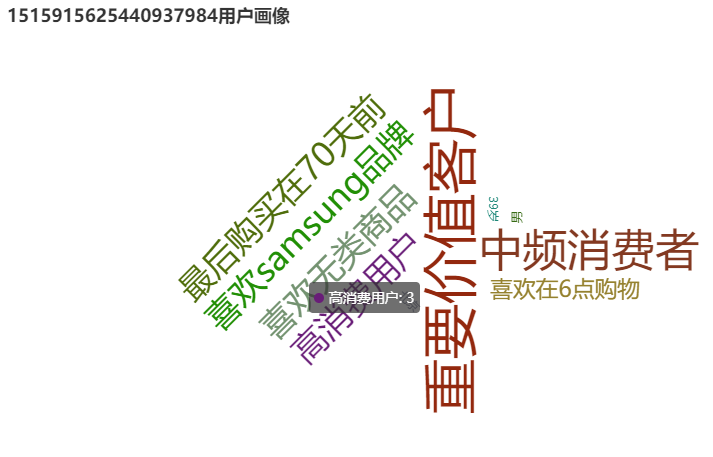

